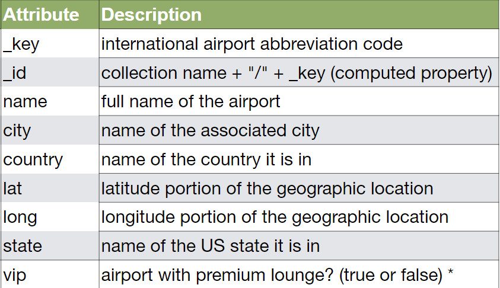
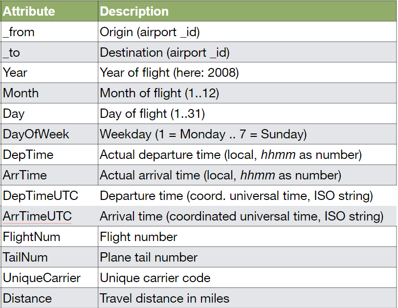

# ArangoDB Foundations

## Running ArangoDB using Docker Compose

```shell
docker-compose up
```

## The database

Dataset of US airports and flights and augmented and simplified it. 

Included are more than 3,000 airports and roughly 300,000 flights from January 1st to 15th, 2008.


### Airports document structure

The data structure of airport documents:




### Flights document structure

The data structure of flights documents:



## Importing the data

ArangoDB command line tool `arangoimport` is required to import the data into the database.

Airports:

```shell
arangoimport --server.endpoint http://localhost:8529 \
 --create-collection true --create-collection-type document --file 'data/airports.json' \
 --collection airports --server.database _system \
 --server.username root --server.password pass
```

Flights:

```shell
arangoimport --server.endpoint http://localhost:8529 \
 --create-collection true --create-collection-type edge \
 --file 'data/flights.json' --collection flights \
 --server.database _system --server.username root \
 --server.password pass --batch-size 100000000
```

## Arango Query Language (AQL)

### Single Document Lookup

```aql
RETURN DOCUMENT("airports/JFK")
```

### Filtering & Primary Key

```aql
FOR airport IN airports
    FILTER airport._key == "JFK"
    RETURN airport
```

### Operators

#### AND

```aql 
FOR airport IN airports   
  FILTER airport.city == "New York"      
  AND airport.state == "NY"   
  RETURN airport
```

#### Sort & Limit

```aql 
FOR a IN airports   
  FILTER a.vip   
  SORT a.state, a.name DESC   
  LIMIT 5   
  RETURN a
```

#### RETURN

You don’t have to RETURN full documents, you can also return just parts of them 
(see the KEEP() and UNSET() functions for instance) or construct the 
query result as you desire.

```aql
FOR a IN airports   
  FILTER a._key IN ["JFK", "LAX"]
  RETURN { name: a.name}
```

#### LENGTH

```aql
RETURN {airportsCount: LENGTH(airports)}
```

#### Graph Traversal

Sintax:

```aql
FOR vertex[, edge[, path]]
  IN [min[..max]]
  OUTBOUND|INBOUND|ANY startVertex
  edgeCollection[, more…]
```

Example: Return the names of all airports one can reach directly (1 step) from Los Angeles International (LAX) following the flights edges:

```aql
WITH airports
FOR airport IN 1..1 
  OUTBOUND
  'airports/LAX' flights
  RETURN DISTINCT airport.name
```

Example: Return any 10 flight documents with the flight departing from LAX and the destination airport documents. 

```aql
WITH airports
FOR airport, flight IN 
  OUTBOUND 
  'airports/LAX' flights
  LIMIT 10
  RETURN {airport, flight}
```

Example: Return 10 flight numbers with the plane landing at Bismarck Municipal Airport (BIS).

```aql
WITH airports
FOR airport, flight IN 
INBOUND
'airports/BIS' flights
  LIMIT 10
  RETURN flight.FlightNum
```

Example:Find all connections which depart from or land at BIS on January 5th and 7th and return to the destination city and the arrival time in universal time (UTC).

```aql
WITH airports
FOR airport, flight IN ANY 
'airports/BIS' flights
  FILTER flight.Month == 1
     AND flight.Day >= 5
     AND flight.Day <= 7
  RETURN { city: airport.city,
           time: flight.ArrTimeUTC }
```


